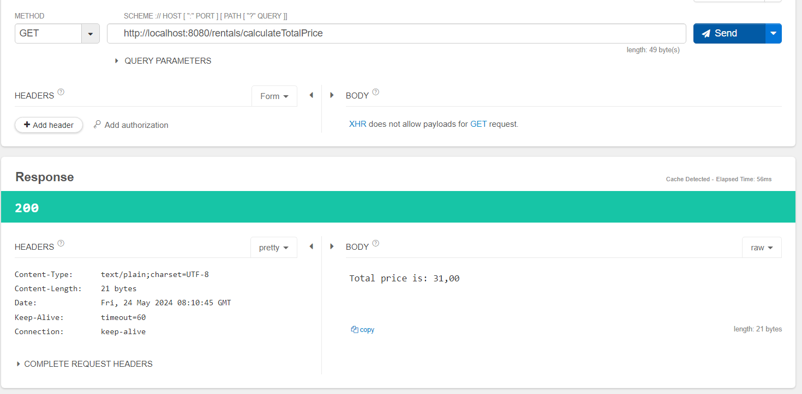

The project has been transferred to Spring Framework in accordance to the video. The changes are as follows:

- Created model classes by identifying and extracting necessary data from the previous project. The classes are: `Customer`, `Genre`, `Movie`, `Rental`, `RentalPricingPolity`
- Created service classes and added appropriate functionality to them (again, based on the previous project)
- Since the project aims to simulate the web application with a database, a simple in-memory database is created, and all the data is stored as class instances (of course, all of it is session only)
- A controller class `RentalController` has been created to handle everything previous bullet point described

End result:

